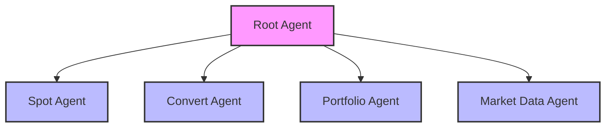
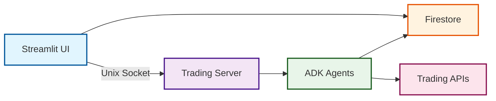

# Smart Trading Assistant

An intelligent cryptocurrency trading bot built with Google Agent Development Kit (ADK), providing natural language trading interface, real-time market data queries, and portfolio management features.

## 🌟 Key Features

- **🤖 Multi-Agent Architecture**: Hierarchical agent system built on Google ADK, including specialized sub-agents for trading, querying, and analysis
- **💬 Natural Language Interface**: Supports Chinese and English natural language commands, intelligently understanding user trading intentions
- **📊 Visual Interface**: Streamlit-based web interface displaying real-time portfolio and trading results
- **🔒 Compliance Management**: Built-in KYC verification and regional restriction checks to ensure trading compliance
- **📈 Real-Time Market Data**: Provides cryptocurrency real-time price queries and exchange rate conversions
- **👥 Multi-User Support**: Supports multiple user account management with independent portfolios and trading histories

## 🏗️ System Architecture

### Agent Hierarchy



### System Components



## 🚀 Quick Start

### Requirements

- Python 3.10 or higher
- Google Cloud Project (for Firestore)
- Unix/Linux system (for Unix socket communication)

### Installation

1. **Install Dependencies**
```bash
pip install -r trading_assistant/requirements.txt
```

2. **Configure Google Cloud Authentication**

Using GCP Application Default Credentials (ADC):
```bash
gcloud auth application-default login
```

3. **Configure Project Settings**

All Google Cloud / Firestore settings live in a single file — `trading_assistant/.env`. Fill in the placeholders:
```bash
GOOGLE_CLOUD_PROJECT=your-gcp-project-id     # your GCP project
FIRESTORE_DATABASE_ID=your-firestore-db-id   # your Firestore database id
```
Both the app and the `user_database` scripts read from this file (values here take precedence over `user_database/config/firebase_config.json`).

4. **Initialize Database**

The project includes a comprehensive user database module for generating and managing mock data. For detailed instructions, see [User Database Documentation](trading_assistant/user_database/README.md).

Quick start:
```bash
cd trading_assistant/user_database
python main.py generate    # Generate mock data
python main.py upload      # Upload to Firestore
```

### Running the Application

**Option 1: Using the run script**
```bash
./run.sh
```

**Option 2: Using ADK native command**
```bash
adk web
```

**Option 3: Manual startup**

1. Start Trading Server:
```bash
python trading_bot_server.py
```

2. Start Web Interface (in a new terminal):
```bash
streamlit run streamlit_frontend.py
```

After starting the application, open your browser and navigate to `http://localhost:8501`

## 📖 Usage Guide

### Supported Trading Commands

#### Spot Trading
- "Buy BTC"
- "Buy ETH with 1000 USDT"
- "Sell 0.5 BNB"

#### Currency Conversion
- "Convert BTC to ETH"
- "Exchange my DOT for ADA"

#### Portfolio Queries
- "Show my assets"
- "What's my account balance?"

#### Market Data
- "What's the current price of BTC?"
- "ETH to BTC exchange rate"

### User Interface

1. **Sidebar**
   - User selector: Switch between different user accounts
   - User profile: Display KYC status, regional restrictions, etc.

2. **Main Interface**
   - Left: Portfolio overview with pie chart and detailed list
   - Right: Chat interface for entering trading commands

## 📁 Project Structure

```
trading-bot/
├── trading_assistant/          # Core trading assistant module
│   ├── agent.py               # Root agent definition
│   ├── prompt.py              # Agent instruction templates
│   ├── config.py              # Configuration management
│   ├── main.py                # Command-line entry point
│   ├── services/              # Service layer
│   │   ├── trading/           # Trading services
│   │   ├── market/            # Market data services
│   │   ├── portfolio/         # Portfolio services
│   │   ├── compliance/        # Compliance check services
│   │   └── database/          # Database services
│   ├── sub_agents/            # Sub-agent implementations
│   │   ├── spot/              # Spot trading agent
│   │   ├── convert/           # Conversion agent
│   │   ├── portfolio/         # Portfolio agent
│   │   └── market_data/       # Market data agent
│   ├── tools/                 # Tool functions
│   └── user_database/         # User data management
├── streamlit_frontend.py      # Web frontend
├── trading_bot_server.py      # Trading server
└── README.md                  # This file
```

## 🔧 Configuration

### User Configuration

User data is stored in Firestore, including:
- User ID and basic information
- KYC verification status
- Region and language settings
- Trading restriction rules

### Compliance Configuration

System supports configuration of:
- Region-restricted coin lists
- Maximum transaction amount limits

### Agent Configuration

Adjustable in `config.py`:
- Model selection (default: gemini-2.0-flash)
- Temperature parameters
- Maximum output tokens

## 🛠️ Development Guide

### Adding New Sub-Agents

1. Create a new folder under `sub_agents/`
2. Implement `agent.py` to define agent behavior
3. Implement `tools.py` to define specialized tools
4. Register the new sub-agent in the root agent

### Extending Trading Features

1. Add new trading services in `services/trading/`
2. Create corresponding tool functions
3. Update agent instructions to recognize new trading types

### Customizing Frontend

The Streamlit frontend can be customized by modifying `streamlit_frontend.py`:
- Add new visualization components
- Modify layout and styling
- Integrate additional data displays

## 📊 API Reference

### Core Service Interfaces

#### Trading Services
- `create_spot_order()` - Create spot orders
- `convert_currency()` - Execute currency conversions

#### Market Data
- `get_market_price()` - Get cryptocurrency prices
- `get_exchange_rate()` - Get exchange rates

#### Portfolio
- `get_user_portfolio()` - Query user assets

#### Compliance Checks
- `get_kyc_status()` - Get KYC status
- `get_region_restrictions()` - Get regional restrictions

## 🚧 Deployment

### Cloud Run Deployment

```bash
./deploy_cloud_run.sh
```

### Streamlit Cloud Deployment

```bash
./deploy_streamlit.sh
```
