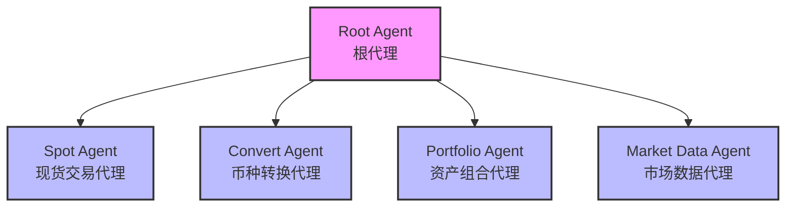
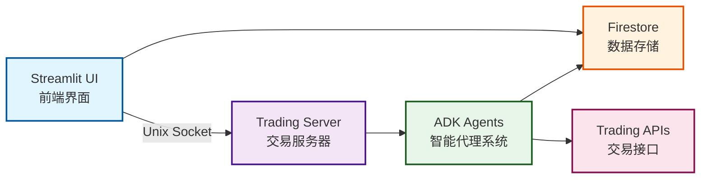

# 智能交易助手

一个基于 Google Agent Development Kit (ADK) 构建的智能加密货币交易机器人，提供自然语言交易接口、实时市场数据查询、资产组合管理等功能。

## 🌟 主要特性

- **🤖 多智能体架构**: 基于 Google ADK 构建的分层智能体系统，包含交易、查询、分析等专业子代理
- **💬 自然语言交互**: 支持中英文自然语言指令，智能理解用户交易意图
- **📊 可视化界面**: 基于 Streamlit 的 Web 界面，实时展示资产组合和交易结果
- **🔒 合规管理**: 内置 KYC 验证和地区限制检查，确保交易合规性
- **📈 实时市场数据**: 提供加密货币实时价格查询和汇率转换
- **👥 多用户支持**: 支持多用户账户管理，独立的资产组合和交易历史

## 🏗️ 系统架构

### 智能体层级结构



### 系统组件架构



## 🚀 快速开始

### 环境要求

- Python 3.10 或更高版本
- Google Cloud 项目（用于 Firestore）
- Unix/Linux 系统（用于 Unix socket 通信）

### 安装步骤

1. **安装依赖**
```bash
pip install -r trading_assistant/requirements.txt
```

2. **配置 Google Cloud 认证**

使用 GCP Application Default Credentials (ADC) 模式：
```bash
gcloud auth application-default login
```

3. **配置项目参数**

所有 Google Cloud / Firestore 配置集中在唯一的文件 `trading_assistant/.env` 中，填入占位符即可：
```bash
GOOGLE_CLOUD_PROJECT=your-gcp-project-id     # 你的 GCP 项目
FIRESTORE_DATABASE_ID=your-firestore-db-id   # 你的 Firestore 数据库 id
```
应用和 `user_database` 脚本都从该文件读取（此处的值优先于 `user_database/config/firebase_config.json`）。

4. **初始化数据库**

项目包含了一个完整的用户数据库模块，用于生成和管理模拟数据。详细说明请参见 [用户数据库文档](trading_assistant/user_database/README.md)。

快速开始：
```bash
cd trading_assistant/user_database
python main.py generate    # 生成模拟数据
python main.py upload      # 上传到 Firestore
```

### 运行应用

**方式一：使用运行脚本**
```bash
./run.sh
```

**方式二：使用 ADK 原生命令**
```bash
adk web
```

**方式三：手动启动**

1. 启动交易服务器：
```bash
python trading_bot_server.py
```

2. 启动 Web 界面（新终端）：
```bash
streamlit run streamlit_frontend.py
```

启动应用后，打开浏览器访问 `http://localhost:8501`

## 📖 使用指南

### 支持的交易指令

#### 现货交易
- "买入 BTC"
- "用 1000 USDT 买入 ETH"
- "卖出 0.5 BNB"

#### 币种转换
- "将 BTC 转换为 ETH"
- "把我的 DOT 换成 ADA"

#### 资产查询
- "查看我的资产"
- "我的账户余额是多少？"

#### 市场数据
- "BTC 现在的价格是多少？"
- "ETH 对 BTC 的汇率"

### 用户界面说明

1. **侧边栏**
   - 用户选择器：切换不同用户账户
   - 用户资料：显示 KYC 状态、地区限制等信息

2. **主界面**
   - 左侧：资产组合概览，包含饼图和详细列表
   - 右侧：聊天界面，输入交易指令

## 📁 项目结构

```
trading-bot/
├── trading_assistant/          # 核心交易助手模块
│   ├── agent.py               # 根代理定义
│   ├── prompt.py              # 智能体指令模板
│   ├── config.py              # 配置管理
│   ├── main.py                # 命令行入口
│   ├── services/              # 服务层
│   │   ├── trading/           # 交易服务
│   │   ├── market/            # 市场数据服务
│   │   ├── portfolio/         # 资产组合服务
│   │   ├── compliance/        # 合规检查服务
│   │   └── database/          # 数据库服务
│   ├── sub_agents/            # 子代理实现
│   │   ├── spot/              # 现货交易代理
│   │   ├── convert/           # 转换代理
│   │   ├── portfolio/         # 资产组合代理
│   │   └── market_data/       # 市场数据代理
│   ├── tools/                 # 工具函数
│   └── user_database/         # 用户数据管理
├── streamlit_frontend.py      # Web 前端
├── trading_bot_server.py      # 交易服务器
└── README.md                  # 本文件
```

## 🔧 配置说明

### 用户配置

用户数据存储在 Firestore 中，包含：
- 用户 ID 和基本信息
- KYC 验证状态
- 地区和语言设置
- 交易限制规则

### 合规配置

系统支持配置：
- 地区限制的币种列表
- 最大交易金额限制

### 智能体配置

在 `config.py` 中可以调整：
- 模型选择（默认使用 gemini-2.0-flash）
- 温度参数
- 最大输出令牌数

## 🛠️ 开发指南

### 添加新的子代理

1. 在 `sub_agents/` 目录下创建新文件夹
2. 实现 `agent.py` 定义代理行为
3. 实现 `tools.py` 定义专用工具
4. 在根代理中注册新的子代理

### 扩展交易功能

1. 在 `services/trading/` 中添加新的交易服务
2. 创建对应的工具函数
3. 更新智能体指令以识别新的交易类型

### 自定义前端

Streamlit 前端可以通过修改 `streamlit_frontend.py` 来定制：
- 添加新的可视化组件
- 修改布局和样式
- 集成额外的数据展示

## 📊 API 参考

### 核心服务接口

#### 交易服务
- `create_spot_order()` - 创建现货订单
- `convert_currency()` - 执行币种转换

#### 市场数据
- `get_market_price()` - 获取币种价格
- `get_exchange_rate()` - 获取汇率

#### 资产组合
- `get_user_portfolio()` - 查询用户资产

#### 合规检查
- `get_kyc_status()` - 获取 KYC 状态
- `get_region_restrictions()` - 获取地区限制

## 🚧 部署说明

### Cloud Run 部署

```bash
./deploy_cloud_run.sh
```

### Streamlit Cloud 部署

```bash
./deploy_streamlit.sh
```
