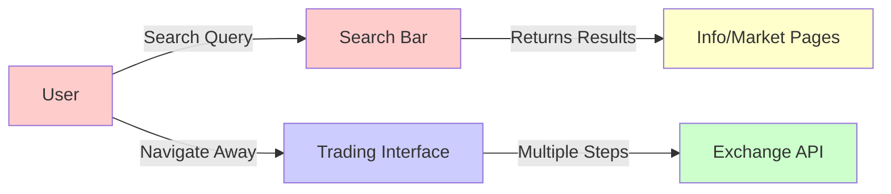
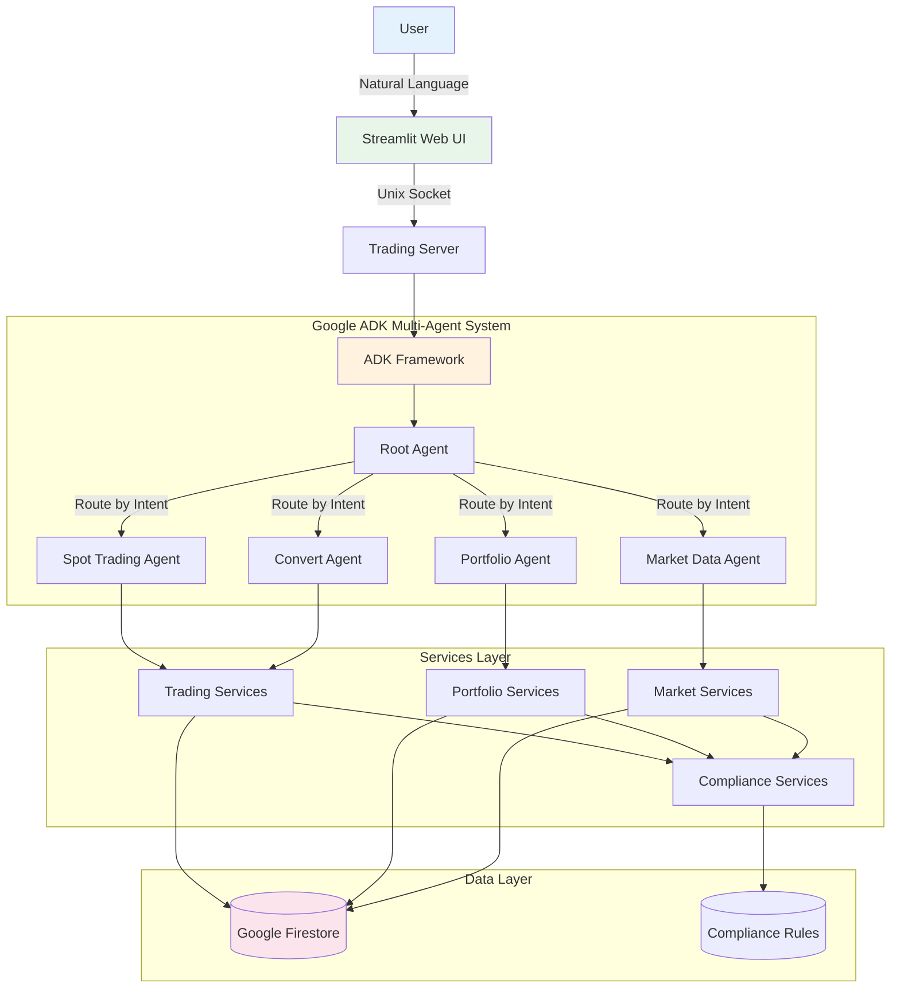
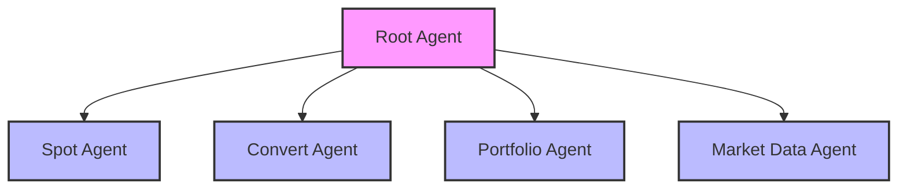
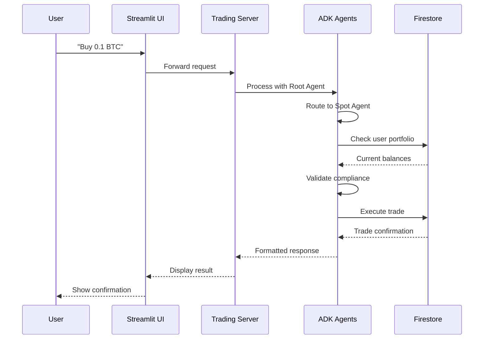
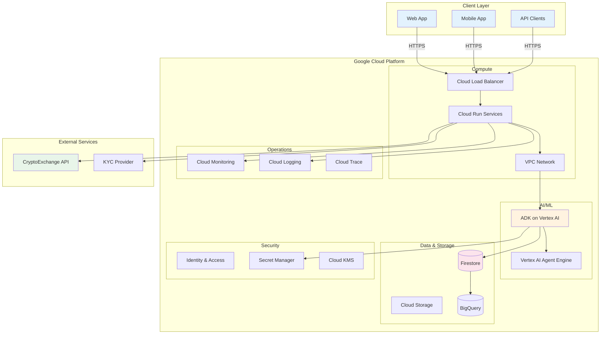
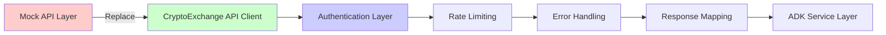

# Smart Trading Assistant
## Solution Design Document

**Customer:** CryptoExchange  
**Date:** Jun 10, 2025  
**Authors:** FSA Team
**Prepared for:** Googlers  
**Version:** 1.0  

---

## About This Document

### Document Highlights

**Purpose**  
This document provides Googlers and customers with a detailed, step-by-step guide to the design and implementation of the Smart Trading Assistant prototype, an intelligent cryptocurrency trading bot built with Google Agent Development Kit (ADK).

**Key Assumptions**  
That the audience has an understanding of:
- Google Cloud Platform services (Firestore, Cloud Run, Application Default Credentials)
- Python programming and web development
- Basic AI/ML concepts and natural language processing
- Cryptocurrency trading terminology

---

## Contents

- [Smart Trading Assistant](#smart-trading-assistant)
  - [Solution Design Document](#solution-design-document)
  - [About This Document](#about-this-document)
    - [Document Highlights](#document-highlights)
  - [Contents](#contents)
  - [1. Context](#1-context)
    - [1.1. Customer Profile](#11-customer-profile)
    - [1.2. Existing State](#12-existing-state)
      - [1.2.1. Current Architecture](#121-current-architecture)
      - [1.2.2. Current Performance](#122-current-performance)
      - [1.2.3. Challenges and Limitations](#123-challenges-and-limitations)
  - [2. Prototype Solution Overview](#2-prototype-solution-overview)
    - [2.1. High-level architecture/workflow](#21-high-level-architectureworkflow)
  - [3. Prototype Implementation Details](#3-prototype-implementation-details)
    - [3.1. Prerequisites and Environment Setup](#31-prerequisites-and-environment-setup)
      - [Google Cloud Platform Requirements](#google-cloud-platform-requirements)
      - [Local Development Requirements](#local-development-requirements)
    - [3.2. Notebooks/Code Repository](#32-notebookscode-repository)
  - [4. Prototype Results](#4-prototype-results)
    - [UI Screenshots](#ui-screenshots)
    - [Performance Expectations](#performance-expectations)
    - [Key Achievements](#key-achievements)
  - [5. Path to Production](#5-path-to-production)
    - [5.1. High-level architecture/workflow](#51-high-level-architectureworkflow)
    - [Production Enhancements](#production-enhancements)
  - [Conclusion](#conclusion)

---

## 1. Context

### 1.1. Customer Profile

CryptoExchange is the world's leading cryptocurrency exchange platform, serving millions of users globally. As the customer for this solution, CryptoExchange:

- Operates the largest cryptocurrency trading platform by volume
- Serves both retail and institutional traders across 180+ countries
- Maintains strict compliance standards across different jurisdictions
- Continuously innovates to provide best-in-class user experience
- Seeks to enhance their platform with AI-powered natural language trading capabilities
- Aims to simplify trading operations for users of all experience levels

### 1.2. Existing State

#### 1.2.1. Current Architecture

CryptoExchange's current web platform includes a search bar feature, but it lacks the intelligence to convert user queries into trading actions. Current state consists of:

- **Basic Search Functionality**: The existing search bar only supports finding cryptocurrencies, markets, and basic information lookup
- **No Trading Intent Recognition**: Search queries cannot trigger trading operations directly
- **Multi-Step Trading Journey**: Users must search for assets, then navigate to trading interfaces to execute trades
- **Low Query-to-Trade Conversion**: Most search queries don't result in actual trades due to the friction in the user journey
- **Traditional Trading Flow**: After searching, users still need to go through multiple screens to complete a trade

#### 1.2.2. Current Performance

CryptoExchange is starting from zero with AI-powered natural language trading capabilities. No existing system processes trading intents from search queries.

**Business Value**: Implementing this solution would improve CTR/CVR and directly increase transaction volume and revenue.

#### 1.2.3. Challenges and Limitations

Key challenges to address:

- No existing natural language understanding for trading queries
- Search functionality isolated from trading systems
- Need to maintain compliance while enabling direct trading
- Integration complexity with existing CryptoExchange infrastructure

---

## 2. Prototype Solution Overview

### 2.1. High-level architecture/workflow

The prototype leverages Google's Agent Development Kit (ADK) to create an intelligent, multi-agent trading assistant with natural language understanding capabilities.

**Key Components:**

1. **Natural Language Interface**: Users interact using everyday language in English or Chinese
2. **Multi-Agent Architecture**: Specialized agents handle different aspects of trading
3. **Compliance Layer**: Built-in KYC and regional restriction checks
4. **Real-time Processing**: Immediate response to user queries and trading requests
5. **Persistent Storage**: Google Firestore for user data and transaction history

**Agent Hierarchy:**

---

## 3. Prototype Implementation Details

### 3.1. Prerequisites and Environment Setup

#### Google Cloud Platform Requirements

| Component | Purpose | Configuration |
|-----------|---------|---------------|
| Google Cloud Project | Platform foundation | New project with billing enabled |
| Firestore API | Data storage | Native mode, multi-region |
| Cloud Run API | Service deployment | For containerized services |
| Artifact Registry API | Container storage | For Docker images |
| Secret Manager API | Secure key storage | For API keys and credentials |
| Application Default Credentials | Authentication | Local development access |
| Service Account | Production auth | With Firestore permissions |

#### Local Development Requirements

| Component | Requirement | Purpose |
|-----------|-------------|---------|
| Python | 3.10 or higher | Runtime environment |
| Operating System | Unix/Linux | Unix socket support |
| Memory | 4GB minimum | ADK processing |
| Disk Space | 10GB | Dependencies and data |
| Google ADK | Latest version | Agent framework |

### 3.2. Notebooks/Code Repository

**Repository Access**: [Insert Git repository URL with appropriate access permissions]

The repository contains all necessary components for running the Smart Trading Assistant prototype, including:
- ADK agent implementations
- Service layer for trading, market data, and compliance
- Mock data generation utilities
- Web UI and backend server
- Documentation and setup guides

---

## 4. Prototype Results

### UI Screenshots

[Placeholder for CryptoExchange UI screenshots]

### Performance Expectations

The prototype demonstrates potential improvements in:
- Search-to-trade conversion through direct intent recognition
- Reduced time from query to trade execution
- Enhanced user experience with natural language interface
- Automated compliance checking

### Key Achievements

1. **Natural Language Understanding**
   - Successfully interprets trading intents in English and Chinese
   - Handles context and multi-turn conversations
   - High accuracy in intent classification

2. **Automated Compliance**
   - Real-time KYC verification
   - Automatic regional restriction enforcement
   - Full compliance with configured rules

3. **User Experience**
   
   **Portfolio View:**
   - Real-time portfolio visualization
   - Interactive pie charts
   - Detailed asset breakdown
   
   **Trading Execution Flow:**
   - User submits natural language query
   - System recognizes trading intent
   - Validates compliance and portfolio
   - Presents clear trade confirmation
   - Executes trade with single confirmation
   - Provides detailed transaction receipt

4. **System Architecture Benefits**

---

## 5. Path to Production

### 5.1. High-level architecture/workflow

The production architecture enhances the prototype with enterprise-grade features:

### Production Enhancements

1. **Security Hardening**
   - OAuth 2.0 / OIDC authentication
   - API key management via Secret Manager
   - End-to-end encryption with Cloud KMS
   - VPC Service Controls for data isolation

2. **Critical API Integrations Required**
   
   The following mock APIs in the prototype must be replaced with CryptoExchange's production APIs:
   
   **a. Trading APIs** (`trading_assistant/services/trading/`)
   - `create_spot_order()` → CryptoExchange Spot Trading API
   - `convert_currency()` → CryptoExchange Convert API
   - Order status tracking → CryptoExchange Order Query API
   
   **b. Market Data APIs** (`trading_assistant/services/market/`)
   - `get_market_price()` → CryptoExchange Market Data API
   - `get_conversion_rate()` → CryptoExchange Exchange Info API
   - Real-time price feeds → CryptoExchange WebSocket Streams
   
   **c. Portfolio APIs** (`trading_assistant/services/portfolio/`)
   - `get_user_portfolio()` → CryptoExchange Account API
   - `update_user_balance()` → CryptoExchange Balance Updates
   - Transaction history → CryptoExchange Trade History API
   
   **d. Compliance APIs** (`trading_assistant/services/compliance/`)
   - `kyc_compliance_check()` → CryptoExchange KYC Verification API
   - `get_region_restrictions()` → CryptoExchange Regional Rules API
   - User authentication → CryptoExchange OAuth/API Key System

3. **API Implementation Flow**

4. **Monitoring & Operations**
   - Custom dashboards in Cloud Monitoring for tracking system health
   - API call metrics and error rates
   - Agent performance monitoring
   - User interaction analytics
   - Real-time alerting for critical issues

---

## Conclusion

The Smart Trading Assistant prototype demonstrates the power of Google's Agent Development Kit in enhancing CryptoExchange's world-class trading platform with intelligent, natural language capabilities. By integrating Google ADK's multi-agent architecture with CryptoExchange's existing infrastructure, this solution provides:

- A revolutionary natural language interface for CryptoExchange users
- Seamless integration with CryptoExchange's compliance framework
- Scalable architecture ready for CryptoExchange's global user base
- Clear path to production deployment on Google Cloud Platform

This prototype positions CryptoExchange at the forefront of AI-powered cryptocurrency trading, making sophisticated trading operations accessible to users of all experience levels through simple conversational commands.

For questions or support, please contact: [support-email@example.com]
